<p align="center">
  
</p>

<h1 align="center">🏗️ 2-TIER APPLICATION DEPLOYMENT</h1>

<p align="center">
  <b>A Complete 2-Tier Client-Server Architecture Deployed on AWS Cloud Infrastructure</b>
</p>

<p align="center">
  
  
  
  
  
  
</p>

<p align="center">
  
  
  
  
</p>

---

## 📋 Table of Contents

- [🌟 Overview](#-overview)
- [✨ Key Features](#-key-features)
- [🏛️ System Architecture](#️-system-architecture)
- [🛠️ Tech Stack](#️-tech-stack)
- [📁 Project Structure](#-project-structure)
- [⚡ Step-by-Step Deployment Guide](#-step-by-step-deployment-guide)
- [🔐 Security Configuration](#-security-configuration)
- [📊 Application Demo](#-application-demo)
- [🚀 Deployment & Production](#-deployment--production)
- [🤝 Contributing](#-contributing)
- [📜 License](#-license)

---

## 🌟 Overview

**2-TIER APPLICATION DEPLOYMENT** is a production-ready AWS cloud infrastructure project demonstrating the **2-Tier Client-Server Architecture** pattern. This project deploys a fully functional web application across **two isolated tiers** on AWS — a **Public Subnet** hosting the web application and a **Private Subnet** protecting the database server.

Built on **Amazon Web Services (AWS)** using core networking and compute services, this deployment showcases how to:

- 🌐 Build a custom **VPC** with public and private subnets for network isolation
- 🖥️ Launch **EC2 instances** in separate tiers with proper security groups
- 🚪 Configure **Internet Gateway** for public web access
- 🔄 Set up **NAT Gateway** for secure outbound access from the private tier
- 🔀 Design **Route Tables** to control traffic flow between tiers
- 🔒 Implement **Security Groups** as instance-level firewalls
- 🗄️ Deploy a **MySQL database** in the private subnet — fully isolated from the internet
- 🌐 Host a **Web Application** on the public EC2 — accessible to end users

> **"Two tiers. Public subnet for the web app. Private subnet for the database. Secure, scalable, production-ready."**

---

## ✨ Key Features

### ☁️ AWS VPC & Networking
| Feature | Description |
|---------|-------------|
| 🌐 **Custom VPC** | Dedicated Virtual Private Cloud (`main-vpc`) with CIDR `10.0.0.0/16` |
| 🏘️ **Public Subnet** | Hosts the web server — accessible from the internet via Internet Gateway |
| 🔒 **Private Subnet** | Hosts the database — completely isolated from direct internet access |
| 🚪 **Internet Gateway** | Enables inbound/outbound internet traffic for the public subnet |
| 🔄 **NAT Gateway** | Allows private subnet to access internet for updates — without being exposed |
| 🔀 **Route Tables** | Custom route tables directing traffic to IGW (public) and NAT (private) |

### 🖥️ Compute & Instances
| Feature | Description |
|---------|-------------|
| 💻 **Public EC2 (`Public_ec2`)** | `t3.micro` Ubuntu instance hosting the web application (Node.js/Flask) |
| 🗄️ **Private EC2 (`Private_ec2`)** | `t3.micro` Ubuntu instance running MySQL database server |
| 🐧 **Ubuntu 26.04 LTS** | Latest long-term support OS on both instances |
| ⚡ **t3.micro Instances** | Free-tier eligible, burstable compute for cost efficiency |

### 🛡️ Security & Access Control
| Feature | Description |
|---------|-------------|
| 🔐 **Security Group — Public** | Allows SSH (port 22) + HTTP (port 80) from anywhere |
| 🔐 **Security Group — Private** | Allows MySQL (port 3306) + SSH (port 22) from VPC only |
| 🚫 **No Public IP on Database** | Private EC2 has no public IPv4 — zero internet exposure |
| 🔑 **Key Pair Authentication** | SSH access secured with `.pem` key pairs |
| 🛡️ **Defense in Depth** | VPC + Subnets + Route Tables + Security Groups = Multi-layer protection |

### 🌐 Web Application
| Feature | Description |
|---------|-------------|
| 📝 **User Registration** | Register form with Username & Password fields |
| ✅ **Database Connectivity** | Registration data stored in MySQL on the private EC2 |
| 🔗 **Cross-Tier Communication** | Web app (Tier 1) connects to database (Tier 2) over port 3306 |
| 🎉 **End-to-End Working** | "Registration successful!" confirms full 2-tier flow |

---

## 🏛️ System Architecture

### Architecture Diagram

```
┌──────────────────────────────────────────────────────────────────────────┐
│                         AWS CLOUD (us-east-1)                            │
│                                                                          │
│  ┌────────────────────────────────────────────────────────────────────┐  │
│  │                    VPC: main-vpc (10.0.0.0/16)                     │  │
│  │                                                                    │  │
│  │   ┌────────────────────────┐    ┌─────────────────────────────┐   │  │
│  │   │   PUBLIC SUBNET        │    │   PRIVATE SUBNET             │   │  │
│  │   │   (172.31.16.0/2)      │    │   (10.0.2.0/27)              │   │  │
│  │   │                        │    │                               │   │  │
│  │   │   ┌────────────────┐   │    │   ┌───────────────────────┐  │   │  │
│  │   │   │ 🖥️ Public_ec2   │   │    │   │ 🗄️ Private_ec2        │  │   │  │
│  │   │   │                │   │    │   │                       │  │   │  │
│  │   │   │ Web Application│───│────│──►│ MySQL Database        │  │   │  │
│  │   │   │ (Port 80)      │   │3306│   │ (Port 3306)           │  │   │  │
│  │   │   │                │   │    │   │                       │  │   │  │
│  │   │   │ 🛡️ SG:         │   │    │   │ 🛡️ SG:                │  │   │  │
│  │   │   │ SSH(22)+HTTP(80)│  │    │   │ MySQL(3306)+SSH(22)   │  │   │  │
│  │   │   └────────────────┘   │    │   └───────────────────────┘  │   │  │
│  │   │          ▲              │    │            │                  │   │  │
│  │   └──────────│──────────────┘    └────────────│──────────────────┘  │  │
│  │              │                                │                     │  │
│  │   ┌──────────│──────────┐    ┌────────────────│──────────────────┐  │  │
│  │   │ 🔀 Public Route     │    │ 🔀 Private Route                  │  │  │
│  │   │ 0.0.0.0/0 → IGW    │    │ 0.0.0.0/0 → NAT Gateway          │  │  │
│  │   └──────────│──────────┘    └────────────────│──────────────────┘  │  │
│  │              │                                │                     │  │
│  └──────────────│────────────────────────────────│─────────────────────┘  │
│                 │                                │                        │
│    ┌────────────│───────────┐    ┌───────────────│──────────────────┐     │
│    │ 🚪 Internet Gateway    │    │ 🔄 NAT Gateway                   │     │
│    │ (main-intergateway)   │    │ (main=gateway)                   │     │
│    └────────────│───────────┘    │ Outbound internet only           │     │
│                 │                └──────────────────────────────────┘     │
└─────────────────│────────────────────────────────────────────────────────┘
                  │
                  ▼
          🌐 INTERNET
          (End Users)
```

### Data Flow

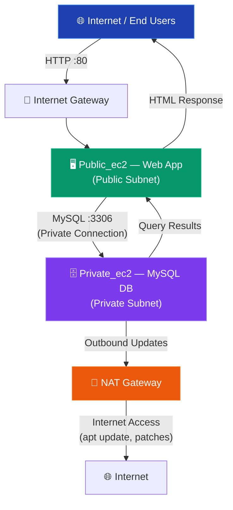

---

## 🛠️ Tech Stack

### AWS Services

| Service | Version/Type | Purpose |
|---------|-------------|---------|
| ☁️ **Amazon VPC** | Custom | Isolated virtual network with CIDR `10.0.0.0/16` |
| 🖥️ **Amazon EC2** | `t3.micro` × 2 | Compute instances for web app + database |
| 🚪 **Internet Gateway** | — | Public internet access for web server |
| 🔄 **NAT Gateway** | Regional, Public | Outbound internet for private subnet |
| 🛡️ **Security Groups** | 2 groups | Instance-level firewall rules |
| 🔀 **Route Tables** | 2 custom | Network traffic routing |
| 🏘️ **Subnets** | Public + Private | Network segmentation |

### Application Stack

| Technology | Version | Purpose |
|-----------|---------|---------|
| 🐧 **Ubuntu** | `26.04 LTS` | Operating system on both EC2 instances |
| 🟢 **Node.js / Flask** | Latest | Web application server (Tier 1) |
| 🐬 **MySQL** | `8.0+` | Relational database (Tier 2) |
| 🌐 **HTML/CSS/JS** | — | Frontend user interface |

### Dev Tools

| Tool | Purpose |
|------|---------|
| 🔑 **SSH / Key Pairs** | Secure remote server access |
| 📦 **apt** | Ubuntu package management |
| 🔄 **Git** | Version control |
| 🖥️ **AWS Console** | Cloud resource management |

---

## 📁 Project Structure

```
2-Tier Application Deployment/
│
├── 📄 README.md                              # This documentation file
│
├── 📂 screenshots/                           # AWS Console screenshots
│   ├── 🖼️ 01-vpc-dashboard.png               # VPC Dashboard (2 VPCs)
│   ├── 🖼️ 02-subnets.png                     # Subnets (public + private)
│   ├── 🖼️ 03-route-tables.png                # Route Tables configuration
│   ├── 🖼️ 04-internet-gateways.png           # Internet Gateways
│   ├── 🖼️ 05-nat-gateway.png                 # NAT Gateway
│   ├── 🖼️ 06-ec2-instances.png               # EC2 Instances (both tiers)
│   ├── 🖼️ 07-security-group-public.png       # Public SG rules (SSH + HTTP)
│   ├── 🖼️ 08-security-group-private.png      # Private SG rules (MySQL + SSH)
│   ├── 🖼️ 09-register-page.png               # Web App — Register Page
│   └── 🖼️ 10-registration-successful.png     # Web App — Success Message
│
└── 📂 code/                                  # Application source code
    ├── 📄 app.js                              # Main application server
    ├── 📄 package.json                        # Node.js dependencies
    ├── 📄 .env                                # Environment variables (git-ignored)
    │
    ├── 📂 views/                              # HTML templates
    │   ├── 📄 register.html                   # Registration page
    │   └── 📄 login.html                      # Login page
    │
    └── 📂 database/                           # SQL scripts
        ├── 📄 schema.sql                       # CREATE TABLE statements
        └── 📄 seed.sql                         # Sample data
```

---

## ⚡ Step-by-Step Deployment Guide

> 📌 Follow these steps in order to deploy the complete 2-Tier Architecture on AWS from scratch.

### Step 1️⃣ — Create VPC (Virtual Private Cloud)

**What it does:** Creates an isolated virtual network on AWS that will contain all your resources.

**Why it's needed:** A VPC gives you full control over IP addressing, subnets, routing, and security — your own private data center in the cloud.

**How to do it:**

1. Navigate to **AWS Console → VPC → Your VPCs → Create VPC**
2. Configure the following settings:

| Setting | Value |
|---------|-------|
| Name tag | `main-vpc` |
| IPv4 CIDR block | `10.0.0.0/16` (65,536 IP addresses) |
| IPv6 CIDR block | No IPv6 |
| Tenancy | Default |

3. Click **Create VPC** ✅

<p align="center">
  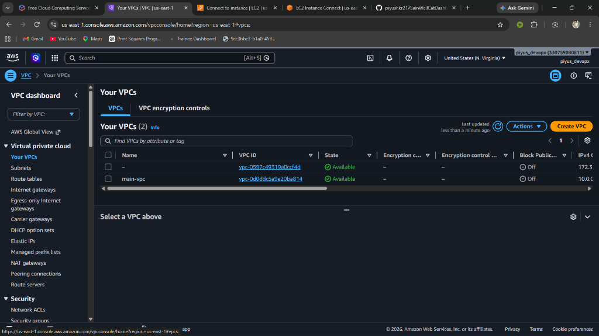
</p>

> 📸 **Screenshot:** The VPC Dashboard showing 2 VPCs — the default VPC (`vpc-0597c49319a0ccf4d`) and our custom `main-vpc` (`vpc-0d0ddc5a9e20ba814`). Both are in **Available** state with IPv4 CIDRs `172.31.0.0/16` and `10.0.0.0/16` respectively.

---

### Step 2️⃣ — Create Subnets (Public & Private)

**What it does:** Divides the VPC into two isolated network segments — a public subnet for the web server and a private subnet for the database.

**Why it's needed:** This is the core of 2-Tier architecture. The public subnet has internet access (via IGW), while the private subnet is completely shielded from the internet — protecting your database from direct exposure.

**How to do it:**

1. Go to **VPC → Subnets → Create subnet**
2. Create the **Public Subnet:**

| Setting | Value |
|---------|-------|
| Name tag | `public-subnet` |
| VPC | `main-vpc` |
| Availability Zone | `us-east-1a` |
| IPv4 CIDR block | `10.0.0.0/24` |
| Auto-assign public IPv4 | ✅ **Enable** |

3. Create the **Private Subnet:**

| Setting | Value |
|---------|-------|
| Name tag | `private-subnet` |
| VPC | `main-vpc` |
| Availability Zone | `us-east-1a` |
| IPv4 CIDR block | `10.0.2.0/27` |
| Auto-assign public IPv4 | ❌ **Disable** |

<p align="center">
  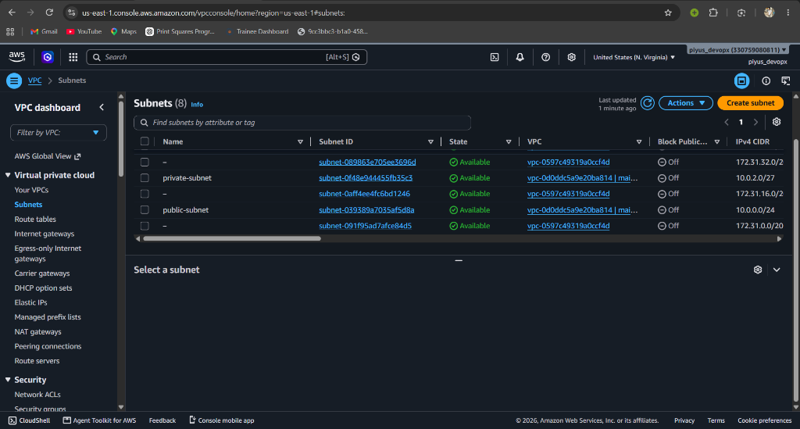
</p>

> 📸 **Screenshot:** The Subnets Dashboard showing 8 subnets. Our custom `public-subnet` (`subnet-039389a7035af5d8a`) and `private-subnet` (`subnet-0f48e044455fb35c3`) are both in **Available** state, associated with their respective VPCs.

---

### Step 3️⃣ — Create & Attach Internet Gateway

**What it does:** Creates a gateway that connects the VPC to the public internet.

**Why it's needed:** Without an Internet Gateway, nothing in your VPC can communicate with the outside world. The IGW acts as the "front door" — allowing users to access your web application hosted in the public subnet.

**How to do it:**

1. Go to **VPC → Internet Gateways → Create internet gateway**
2. Set Name tag: `main-intergateway`
3. Click **Create internet gateway**
4. Select the IGW → **Actions → Attach to VPC → Select `main-vpc`**

<p align="center">
  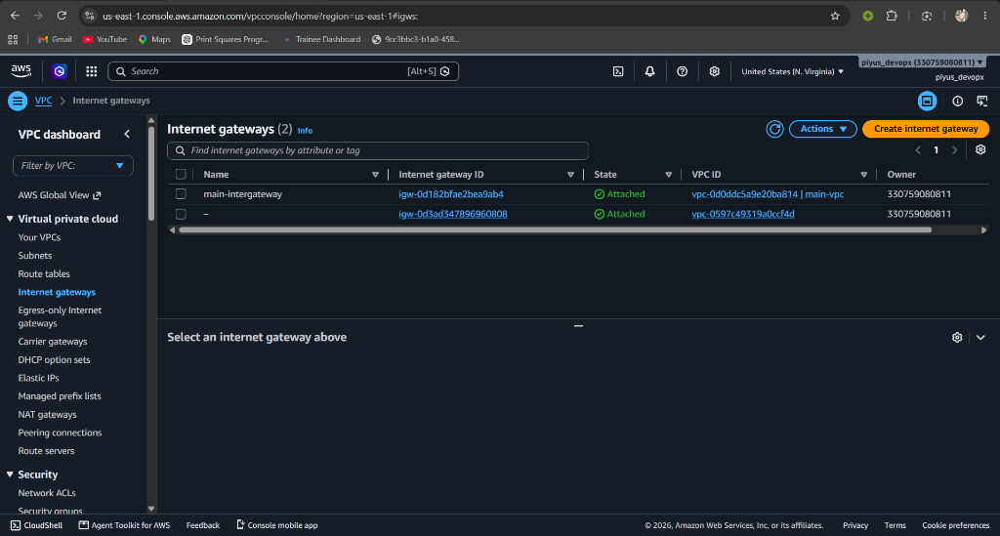
</p>

> 📸 **Screenshot:** 2 Internet Gateways — `main-intergateway` attached to `vpc-0d0ddc5a9e20ba814` (`main-vpc`) and the default IGW. Both show **Attached** state, confirming they are properly connected to their VPCs. Owner account: `330759080811`.

---

### Step 4️⃣ — Create NAT Gateway

**What it does:** Creates a Network Address Translation gateway that allows instances in the private subnet to access the internet for outbound traffic only.

**Why it's needed:** Your database server (in the private subnet) needs to download OS updates, security patches, and install MySQL packages — but should **never** be directly reachable from the internet. The NAT Gateway provides a one-way door: outbound traffic ✅, inbound traffic ❌.

**How to do it:**

1. Go to **VPC → NAT Gateways → Create NAT gateway**
2. Configure:

| Setting | Value |
|---------|-------|
| Name tag | `main=gateway` |
| Subnet | `public-subnet` (⚠️ Must be in the public subnet!) |
| Connectivity type | **Public** |
| Elastic IP | Click **Allocate Elastic IP** |

3. Click **Create NAT gateway**

<p align="center">
  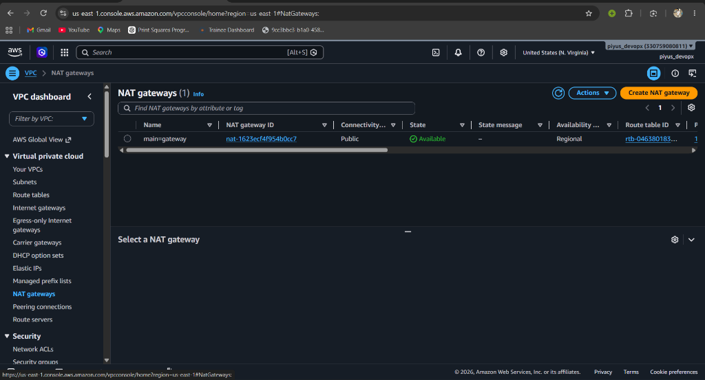
</p>

> 📸 **Screenshot:** NAT Gateway `main=gateway` (`nat-1623ecf4f954b0c7`) with **Public** connectivity type, in **Available** state. It uses route table `rtb-046380183...` and is deployed in a Regional configuration. This ensures the private subnet can access the internet securely.

---

### Step 5️⃣ — Configure Route Tables

**What it does:** Creates routing rules that control where network traffic flows — public traffic goes to the Internet Gateway, private traffic goes to the NAT Gateway.

**Why it's needed:** Route tables are the "traffic signs" of your VPC. Without them, your subnets don't know how to reach the internet or communicate with each other. The public route table sends `0.0.0.0/0` traffic to the IGW, and the private route table sends it to the NAT Gateway.

**How to do it:**

**5a. Create Public Route Table (`public-routes`):**

1. Go to **VPC → Route Tables → Create route table**
2. Name: `public-routes`, VPC: `main-vpc`
3. **Edit routes** → Add route:

| Destination | Target |
|-------------|--------|
| `10.0.0.0/16` | Local (auto-added) |
| `0.0.0.0/0` | Internet Gateway (`main-intergateway`) |

4. **Subnet associations** → Associate `public-subnet`

**5b. Create Private Route Table (`private-routes`):**

1. Create another route table: Name: `private-routes`, VPC: `main-vpc`
2. **Edit routes** → Add route:

| Destination | Target |
|-------------|--------|
| `10.0.0.0/16` | Local (auto-added) |
| `0.0.0.0/0` | NAT Gateway (`main=gateway`) |

3. **Subnet associations** → Associate `private-subnet`

<p align="center">
  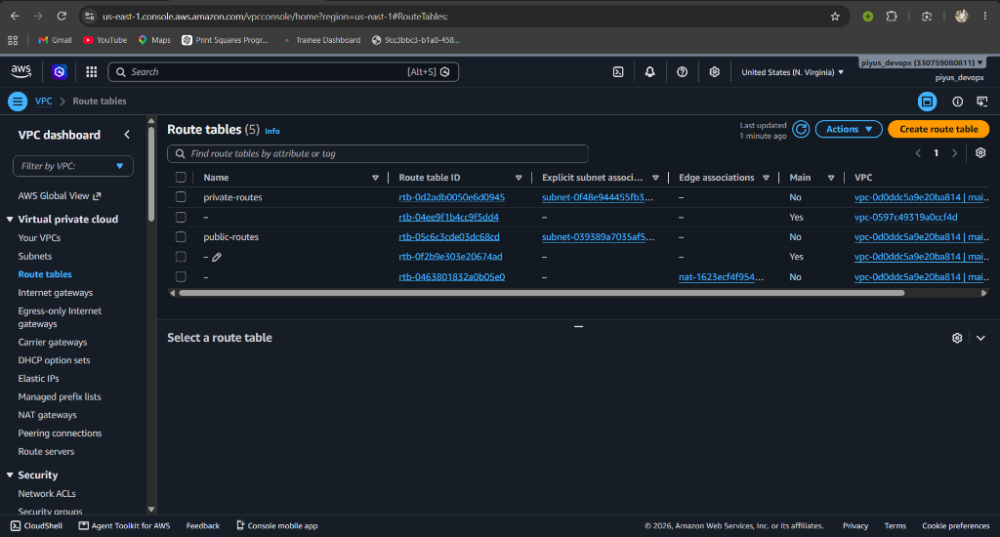
</p>

> 📸 **Screenshot:** 5 Route Tables configured. `private-routes` (`rtb-0d2adb0050e6d0945`) is associated with `private-subnet` via `subnet-0f48e944455fb3...`. `public-routes` (`rtb-05c6c3cde03dc68cd`) is associated with `public-subnet` via `subnet-039389a7035af5...`. Both are linked to `main-vpc`. The NAT gateway route table (`rtb-04638...`) is also visible with its association to `nat-1623ecf4f954...`.

---

### Step 6️⃣ — Create Security Groups

**What it does:** Creates virtual firewalls that control inbound and outbound traffic at the instance level.

**Why it's needed:** Security Groups are the most critical security layer. They define exactly which ports, protocols, and IP ranges can access each EC2 instance. The public EC2 needs HTTP + SSH access from the internet, while the private EC2 only needs MySQL + SSH access from within the VPC.

**How to do it:**

**6a. Security Group for Public EC2 (`launch-wizard-31`):**

| Rule | Type | Protocol | Port | Source | Purpose |
|------|------|----------|------|--------|---------|
| Inbound | **SSH** | TCP | `22` | `0.0.0.0/0` | Remote server management |
| Inbound | **HTTP** | TCP | `80` | `0.0.0.0/0` | Web application traffic |

<p align="center">
  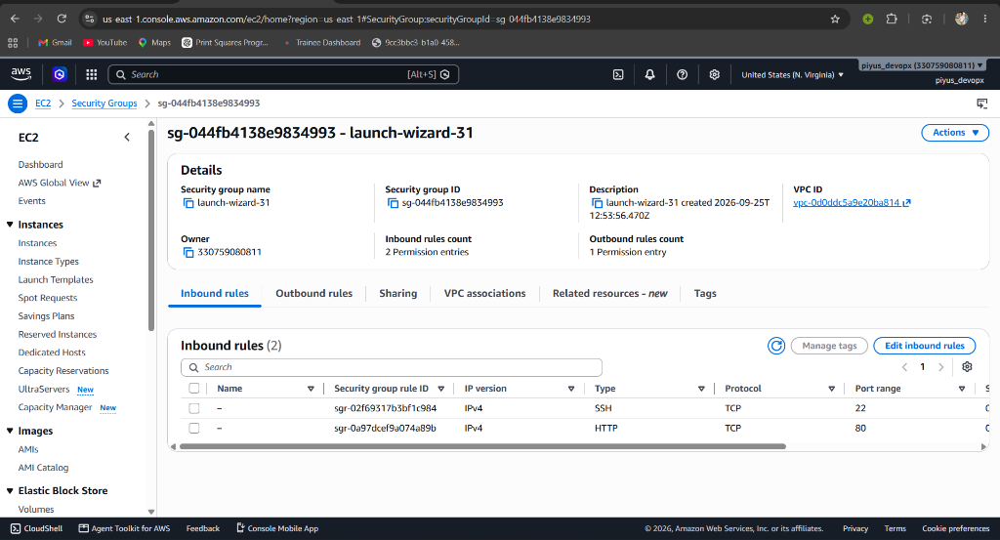
</p>

> 📸 **Screenshot:** Security Group `sg-044fb4138e9834993` (`launch-wizard-31`) with 2 inbound rules — **SSH on port 22** (TCP, IPv4) and **HTTP on port 80** (TCP, IPv4). Created `2026-09-25` and associated with `vpc-0d0ddc5a9e20ba814` (`main-vpc`). Owner: `330759080811`. This allows users to access the web app and admins to SSH in.

**6b. Security Group for Private EC2 (`launch-wizard-32`):**

| Rule | Type | Protocol | Port | Source | Purpose |
|------|------|----------|------|--------|---------|
| Inbound | **MySQL/Aurora** | TCP | `3306` | VPC CIDR / Public SG | Database queries from web server |
| Inbound | **SSH** | TCP | `22` | VPC CIDR / Public SG | Admin access via jump box |

<p align="center">
  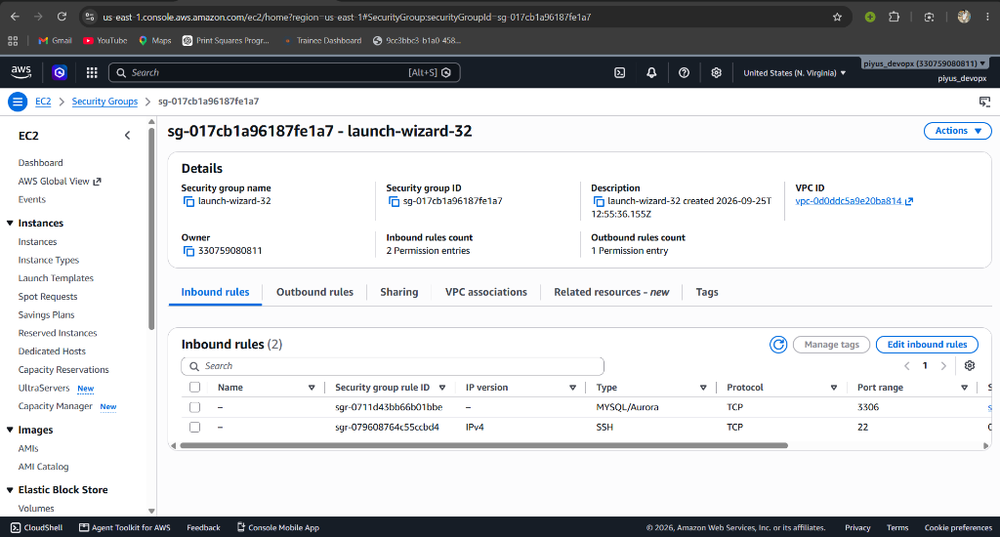
</p>

> 📸 **Screenshot:** Security Group `sg-017cb1a96187fe1a7` (`launch-wizard-32`) with 2 inbound rules — **MySQL/Aurora on port 3306** (TCP) and **SSH on port 22** (TCP, IPv4). Created `2026-09-25` and associated with `vpc-0d0ddc5a9e20ba814` (`main-vpc`). **No HTTP rule** — the database is completely inaccessible from the internet.

---

### Step 7️⃣ — Launch EC2 Instances

**What it does:** Launches two virtual servers — one in the public subnet (web application) and one in the private subnet (database).

**Why it's needed:** These are the actual compute resources that run your application. The public EC2 serves the web pages to users, and the private EC2 stores all the data securely.

**How to do it:**

**7a. Launch `Public_ec2` (Web Server):**

| Setting | Value |
|---------|-------|
| Name | `Public_ec2` |
| AMI | Ubuntu 26.04 LTS (`ami-0b6d9d3d33ba97d99`) |
| Instance type | `t3.micro` (Free-tier eligible) |
| Key pair | Select or create a `.pem` key pair |
| VPC | `main-vpc` |
| Subnet | `public-subnet` |
| Auto-assign public IP | ✅ **Enable** |
| Security group | `launch-wizard-31` (SSH + HTTP) |

**7b. Launch `Private_ec2` (Database Server):**

| Setting | Value |
|---------|-------|
| Name | `Private_ec2` |
| AMI | Ubuntu 26.04 LTS |
| Instance type | `t3.micro` |
| Key pair | Same key pair |
| VPC | `main-vpc` |
| Subnet | `private-subnet` |
| Auto-assign public IP | ❌ **Disable** |
| Security group | `launch-wizard-32` (MySQL + SSH) |

<p align="center">
  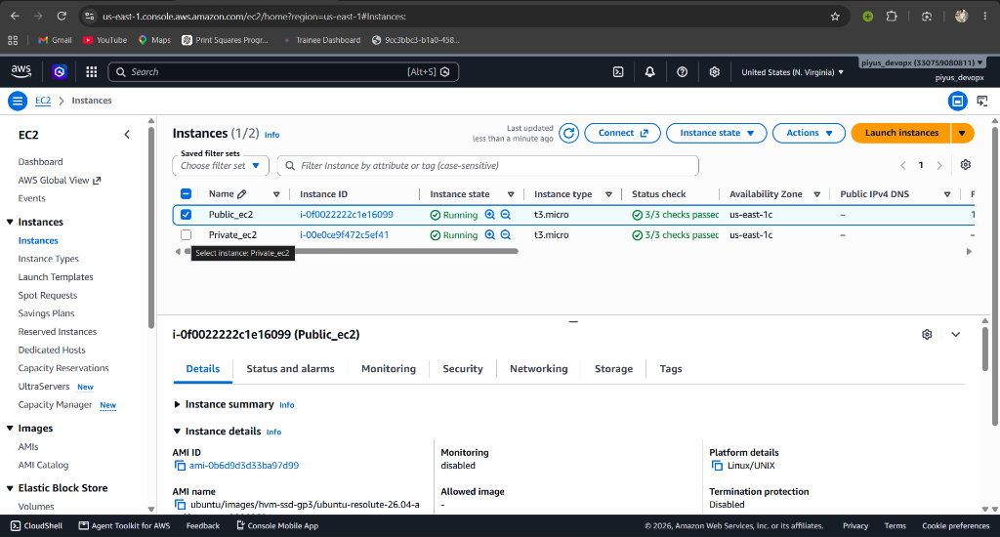
</p>

> 📸 **Screenshot:** EC2 Instances Dashboard showing both instances in **Running** state with **3/3 status checks passed** ✅. `Public_ec2` (`i-0f0022222c1e16099`) is selected, showing details — AMI: `ubuntu/images/hvm-ssd-gp3/ubuntu-resolute-26.04-a`, Platform: `Linux/UNIX`, Instance type: `t3.micro`, AZ: `us-east-1c`. `Private_ec2` (`i-00e0ce9f472c5ef41`) is also `t3.micro` in `us-east-1c`.

---

### Step 8️⃣ — Deploy the Web Application

**What it does:** Installs the web application on the public EC2 and MySQL database on the private EC2, then connects them together.

**Why it's needed:** This is the final step that brings everything together — the web app handles user requests (Tier 1) and stores/retrieves data from the database (Tier 2).

**8a. Connect to Public EC2 via SSH:**

```bash
# SSH into the Public EC2 using your key pair
ssh -i "your-key.pem" ubuntu@18.209.70.46
```

**8b. Install Web Application on Public EC2:**

```bash
# Update system packages
sudo apt update && sudo apt upgrade -y

# Install Node.js
curl -fsSL https://deb.nodesource.com/setup_18.x | sudo -E bash -
sudo apt install -y nodejs

# Clone application code
git clone <your-repo-url>
cd code/

# Install dependencies
npm install

# Configure database connection
nano .env
```

```env
DB_HOST=<Private_EC2_Private_IP>    # e.g., 10.0.2.15
DB_PORT=3306
DB_NAME=two_tier_app
DB_USER=appuser
DB_PASSWORD=your_secure_password
APP_PORT=80
```

```bash
# Start the application
sudo node app.js
```

**8c. Setup MySQL on Private EC2 (via SSH jump through Public EC2):**

```bash
# From Public EC2, SSH into Private EC2
ssh -i "your-key.pem" ubuntu@<Private_EC2_Private_IP>

# Install MySQL Server
sudo apt update
sudo apt install -y mysql-server

# Secure the installation
sudo mysql_secure_installation

# Create database and user
sudo mysql -u root -p
```

```sql
CREATE DATABASE two_tier_app;
CREATE USER 'appuser'@'%' IDENTIFIED BY 'your_secure_password';
GRANT ALL PRIVILEGES ON two_tier_app.* TO 'appuser'@'%';
FLUSH PRIVILEGES;

USE two_tier_app;
CREATE TABLE users (
    id INT AUTO_INCREMENT PRIMARY KEY,
    username VARCHAR(100) NOT NULL,
    password VARCHAR(255) NOT NULL,
    created_at TIMESTAMP DEFAULT CURRENT_TIMESTAMP
);
```

```bash
# Configure MySQL to accept remote connections
sudo nano /etc/mysql/mysql.conf.d/mysqld.cnf
# Change: bind-address = 0.0.0.0

# Restart MySQL
sudo systemctl restart mysql
```

---

## 📊 Application Demo

After completing all 8 steps, the web application is **live and accessible** via the Public EC2's public IP address!

### 📝 Register Page — Tier 1 (Web Application)

<p align="center">
  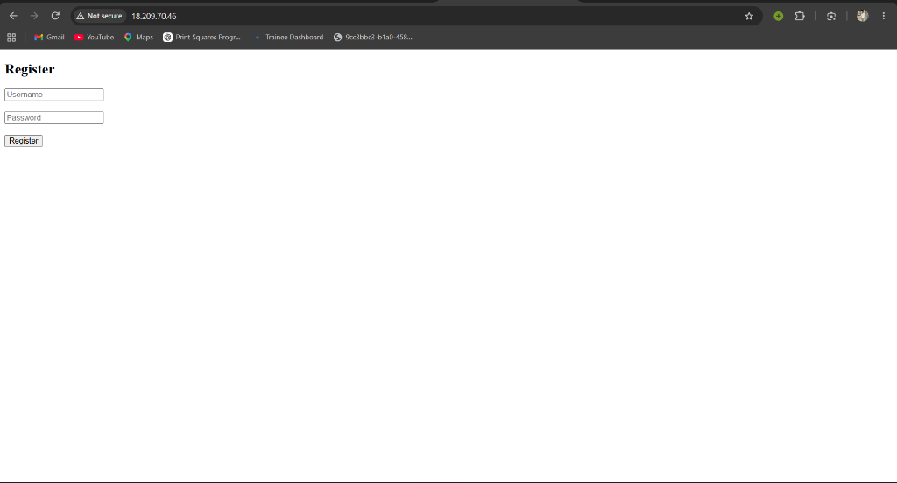
</p>

> 📸 **Screenshot:** The **Register** page of the 2-Tier application running on the Public EC2 at `http://18.209.70.46`. The page displays Username and Password input fields with a Register button. This is **Tier 1 (Presentation Layer)** — the web server hosting the frontend that users interact with.

### ✅ Registration Successful — Full 2-Tier Flow Working!

<p align="center">
  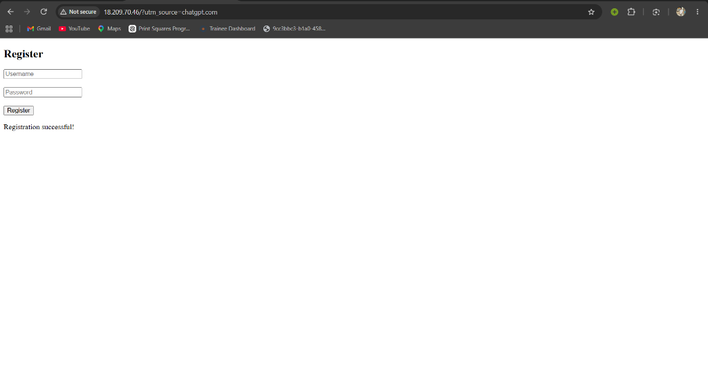
</p>

> 📸 **Screenshot:** After submitting the registration form, the page shows **"Registration successful!"** — this confirms the complete 2-Tier data flow:
>
> | Step | What Happened |
> |------|---------------|
> | 1️⃣ | User filled the form on `http://18.209.70.46` (Public EC2 — Tier 1) |
> | 2️⃣ | Web app validated and processed the form data |
> | 3️⃣ | Web app connected to MySQL on Private EC2 (Tier 2) via port `3306` |
> | 4️⃣ | MySQL inserted the user record into the `users` table |
> | 5️⃣ | Success response sent back to the browser |
> | ✅ | **End-to-end 2-Tier architecture is working perfectly!** 🎉 |

---

## 🔐 Security Configuration

### Multi-Layer Security Architecture

```
┌─────────────────────────────────────────────────────────────────┐
│                    SECURITY LAYERS (Defense in Depth)            │
│                                                                  │
│  Layer 1: VPC Isolation                                          │
│  └── Dedicated network (10.0.0.0/16) — isolated from other VPCs│
│                                                                  │
│  Layer 2: Subnet Segmentation                                    │
│  ├── Public Subnet  → Internet access via IGW ✅                │
│  └── Private Subnet → NO direct internet access ❌              │
│                                                                  │
│  Layer 3: Route Tables                                           │
│  ├── Public routes  → 0.0.0.0/0 → Internet Gateway             │
│  └── Private routes → 0.0.0.0/0 → NAT Gateway (outbound only)  │
│                                                                  │
│  Layer 4: Security Groups (Instance-level firewall)              │
│  ├── Public EC2:  SSH(22) + HTTP(80) from 0.0.0.0/0            │
│  └── Private EC2: MySQL(3306) + SSH(22) from VPC only           │
│                                                                  │
│  Layer 5: Key Pair Authentication                                │
│  └── SSH access requires .pem private key — no password auth    │
└─────────────────────────────────────────────────────────────────┘
```

### Why the Database is Secure

| Protection | Mechanism |
|-----------|-----------|
| ❌ **No public IP** | Private EC2 has no public IPv4 address assigned |
| ❌ **No IGW route** | Private route table points to NAT, not Internet Gateway |
| ❌ **No HTTP rule** | Security group has NO port 80 — zero web access |
| ✅ **MySQL from VPC only** | Port 3306 open only to traffic from within the VPC |
| ✅ **SSH via jump box** | SSH access only through Public EC2 as bastion host |
| ✅ **NAT for updates** | Can download patches without being internet-facing |

---

## 🚀 Deployment & Production

### Quick Reference — All Steps Summary

```bash
# Step 1: Create VPC (main-vpc, CIDR 10.0.0.0/16)
# Step 2: Create Subnets (public-subnet + private-subnet)
# Step 3: Create & Attach Internet Gateway (main-intergateway)
# Step 4: Create NAT Gateway (main=gateway in public-subnet)
# Step 5: Configure Route Tables (public → IGW, private → NAT)
# Step 6: Create Security Groups (public: SSH+HTTP, private: MySQL+SSH)
# Step 7: Launch EC2 Instances (Public_ec2 + Private_ec2)
# Step 8: Deploy App (Node.js on public, MySQL on private)
```

### Production Recommendations

| Area | Recommendation |
|------|---------------|
| 🔒 **Security** | Restrict SSH to your IP only (`your-ip/32` instead of `0.0.0.0/0`) |
| 📊 **Monitoring** | Enable CloudWatch alarms for CPU, memory, and network |
| 💾 **Backups** | Enable automated EBS snapshots and MySQL backups |
| ⚡ **Scaling** | Use Auto Scaling Group + Application Load Balancer for Tier 1 |
| 🗄️ **Database** | Consider migrating to Amazon RDS for managed MySQL |
| 🔐 **HTTPS** | Add SSL/TLS certificate via AWS Certificate Manager + ALB |
| 🌐 **Domain** | Configure Route 53 for custom domain name |

---

## 🤝 Contributing

Contributions are welcome! Here's how to get started:

### Steps

1. **Fork** the repository
2. **Create** a feature branch
   ```bash
   git checkout -b feature/amazing-feature
   ```
3. **Commit** your changes
   ```bash
   git commit -m "feat: add amazing feature"
   ```
4. **Push** to your branch
   ```bash
   git push origin feature/amazing-feature
   ```
5. **Open** a Pull Request

### Commit Convention

| Prefix | Usage |
|--------|-------|
| `feat:` | New feature |
| `fix:` | Bug fix |
| `docs:` | Documentation update |
| `infra:` | Infrastructure changes |
| `style:` | Code formatting (no logic change) |
| `refactor:` | Code restructuring |
| `chore:` | Maintenance tasks |

---

## 📜 License

This project is licensed under the **MIT License**.

```
MIT License

Copyright (c) 2026 2-Tier Application Deployment

Permission is hereby granted, free of charge, to any person obtaining a copy
of this software and associated documentation files (the "Software"), to deal
in the Software without restriction, including without limitation the rights
to use, copy, modify, merge, publish, distribute, sublicense, and/or sell
copies of the Software, and to permit persons to whom the Software is
furnished to do so, subject to the following conditions:

The above copyright notice and this permission notice shall be included in all
copies or substantial portions of the Software.
```

---

<p align="center">
  <b>Built with ❤️ by <a href="https://github.com/piyushkr21">Piyush Kumar</a></b>
</p>

<p align="center">
  
</p>

<p align="center">
  <a href="#-table-of-contents">⬆️ Back to Top</a>
</p>
